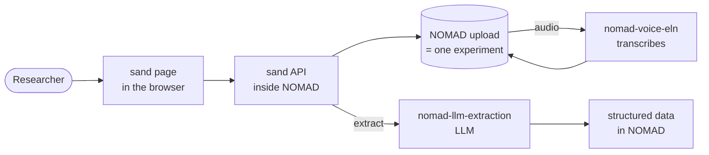

# sand

A voice and text assistant for the lab. Researchers record or type what they
do during an experiment; sand stores it in NOMAD and turns it into structured
data with an LLM.

- **Record** spoken notes, with a live transcript while speaking.
- **Write** notes by hand.
- **Review** all inputs of an experiment in time order, and correct their text.
- **Extract** the experiment into structured data for a lab's format.
- **Voice mode**: start and stop recordings by voice, for work where the
  hands are not free (e.g. in a glove box).

## How it works



- An **experiment** is one NOMAD upload. It holds an `InputCollection` entry
  and every recording (`AudioInput`) and note (`WrittenNote`) made for it.
  These entry types come from
  [`nomad-voice-eln`](https://github.com/FAIRmat-NFDI/nomad-voice-eln).
- sand does not transcribe or store anything itself: audio, transcripts and
  corrections live in the NOMAD entries.
- **Extraction** runs as a NOMAD action on the action worker. The LLM reads
  the inputs in time order and fills in the lab's format.
  Currently supported format: **hysprint** (solar cell processing; the result
  is a batch sheet read by [`nomad-hysprint`](https://github.com/nomad-hzb/nomad-hysprint)).

## Setup

sand is a **NOMAD plugin**, not a standalone app. It runs inside a NOMAD
instance; for development, use
[`nomad-distro-dev`](https://github.com/FAIRmat-NFDI/nomad-distro-dev).

### Requirements

Install these plugins in the same NOMAD:

- [`nomad-voice-eln`](https://github.com/FAIRmat-NFDI/nomad-voice-eln)
- [`nomad-llm-extraction`](https://github.com/FAIRmat-NFDI/nomad-llm-extraction)

### 1. Add sand to the distribution

From the root of `nomad-distro-dev`:

```sh
git submodule add https://github.com/FAIRmat-NFDI/sand.git packages/sand
uv add packages/sand
```

### 2. Configure `nomad.yaml`

`uv run poe setup` (step 3) creates `nomad.yaml` if it is missing. Enable the
entry points and set sand's options:

```yaml
plugins:
  entry_points:
    include:
      - sand.apis:sand_api
      - sand.actions.extract:extract_action_entry_point
      - nomad_gui.apis:gui_api
      - nomad_voice_eln.schema_packages:schema_package_entry_point
      - nomad_voice_eln.parsers:parser_entry_point
      - nomad_voice_eln.actions.transcribe:transcribe_action_entry_point
      - nomad_voice_eln.actions.record_note:record_note_action_entry_point
      - nomad_llm_extraction.actions:llm_extractor_action_entry_point
      # the extraction format
      - nomad_hysprint.schema_packages:hysprint_package
      - nomad_hysprint.parsers:hysprint_experiment_parser
    options:
      sand.apis:sand_api:
        llm_model_name: 'gemini/gemini-2.5-flash'  # LiteLLM notation
        nomad_base_url: 'http://localhost:8000/nomad-oasis/api/v1'
        # live transcript while recording; optional, empty = off
        # (also read from DEEPGRAM_API_KEY)
        deepgram_api_key: '<your-deepgram-api-key>'
        deepgram_model: 'nova-3'
        # default of the "save live transcript" toggle
        # store_live_transcript: true
        launch_modes: ['tab']
```

`include` is a whitelist: every other plugin you use must be listed too.

> [!WARNING]
> Do not commit real API keys.

### 3. Start NOMAD

From the root of `nomad-distro-dev`:

```sh
uv run poe setup
docker compose up -d
uv sync
uv run poe start
```

In a second terminal, start the action worker. Transcription and extraction
run there, so it needs the API keys:

```sh
export GROQ_API_KEY=<your-groq-key>       # transcription (Whisper)
export GEMINI_API_KEY=<your-gemini-key>   # extraction; the key of your llm_model_name's provider
uv run poe cpuworker
```

### 4. Open sand

In the NOMAD GUI, go to *Dashboards* → sand. It opens in a new tab at
(trailing slash needed):

```
http://localhost:8000/nomad-oasis/dashboards/sand/
```

**Login:** sand has no login of its own. It uses the NOMAD GUI's, which
renews the login token while it is open. Keep a NOMAD GUI tab open in the
same browser; sand warns when the login is about to end.

## Voice mode

Optional.

1. Select an experiment and click **Voice mode on**.
2. sand checks the experiment, the login, the recognizer and the microphone.
   When asked, say **"hey sand"** within 10 seconds; otherwise voice mode
   stays off and you can click again.
3. **Listening** is shown: voice mode is on.

| To | Say |
|---|---|
| start a recording | **"hey sand, start record"** |
| stop and save it | **"hey sand, stop recording"** |

"hi sand" works too, and so do small variants ("start recording", "stop the
recording"). "stop" alone does nothing.

| Beep | Meaning |
|---|---|
| rising | recording runs |
| falling | recording stopped |
| one high tone | saved in NOMAD |
| two low tones | it failed; the screen says why |

No beep: the command was not understood, say it again.

**Tips**

- Pause briefly before and after a command. A command in the middle of a
  sentence is part of the note.
- Start speaking the note after the rising beep.
- A headset or clip-on microphone works much better than a laptop mic.
- The Record and Stop buttons keep working.
- English only.

**Privacy:** while listening, speech is recognized in the browser only;
nothing is sent or stored. Audio leaves the computer only during a
recording, as with the Record button.

## Development

```sh
uv sync --all-extras
uv run pytest
node --test tests/js/*.test.mjs   # frontend logic, no dependencies
ruff check .
```
